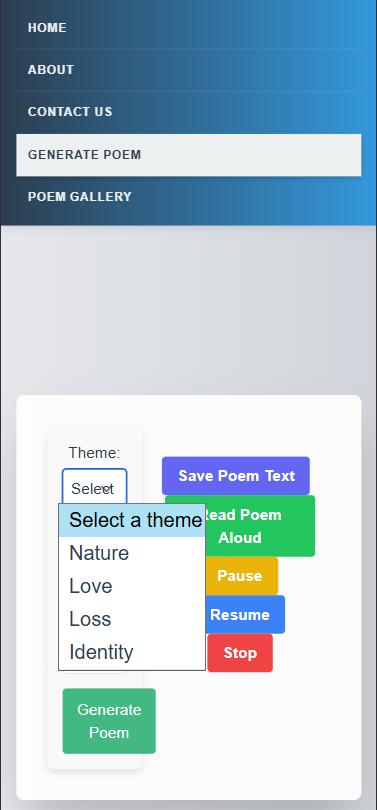

# Bug Report

---

### Bug ID: BUG-001  
**Title**: Save Poem Text does not download file  

**Steps to Reproduce**  
1. Generate a poem  
2. Click "Save Poem Text"  

**Expected Result**  
A `.txt` file should download containing the poem text.  

**Actual Result**  
No file is downloaded.  

**Severity**  
Medium (core functionality: saving poems does not work).  

**Status**  
Open  

**Attachments**  
(Screenshot if possible)

---

### Bug ID: BUG-002  
**Title**: No error handling when saving without generated poem  

**Steps to Reproduce**  
1. Do not generate a poem  
2. Click "Save Poem Text" or "Save Poem Image"  

**Expected Result**  
Should show error message ("No poem to save") or save a blank file.  

**Actual Result**  
No error messages are displayed and no blank files are saved.  

**Severity**  
Low (missing user feedback for invalid action).  

**Status**  
Open  

**Attachments**  
(Screenshot if possible)

---

### Bug ID: BUG-003  
**Title**: Mobile layout issues with overlapping UI elements  

**Steps to Reproduce**  
1. Open app on mobile browser (iPhone 12 Pro dimensions: 390x844)  
2. Open Theme dropdown  
3. Try to access audio control buttons  

**Expected Result**  
All dropdowns, buttons, and controls should be accessible without layout overlap.  

**Actual Result**  
While the basic functionality appears to work (dropdown opens, buttons are present), the layout issues prevent proper user interaction.

**Severity**  
Medium (mobile usability issues affect user experience).  

**Status**  
Open  

**Attachments**  
Mobile screenshot showing dropdown overlap with audio controls

